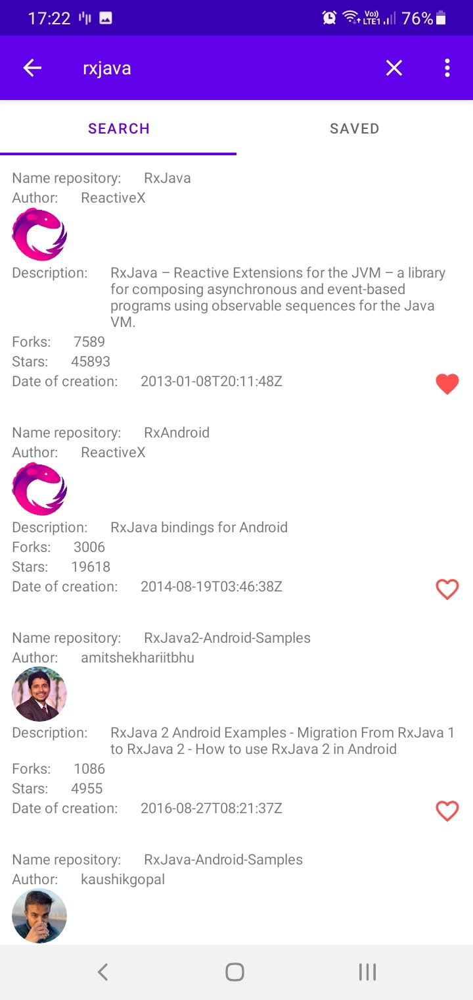
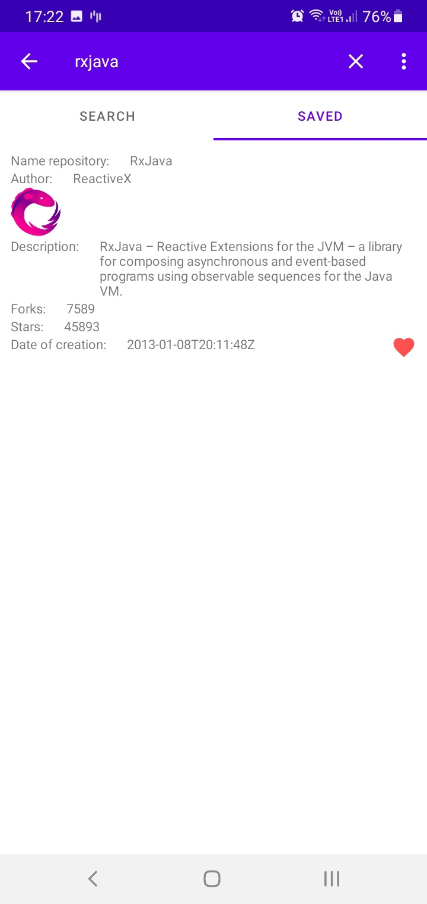

# Github App

    
    
    

## About

Demo app, that allows get repositories from github and save them on phone. Also user can authorize by google or sign in without authorization.
App was created within [task](forReadme/Тестовое%20задание%20Android-разработчик.pdf)

This repository contains a detailed sample app that implements MVP architecture in Kotlin using Dagger2, Room, RxJava, Moxy, Retrofit, single Activity, navigation component.
 

#### The app has following packages:
1. **business**: It contains all interactors.
2. **data**: It contains all the data accessing and manipulating components.
3. **di**: Dependency providing classes using Dagger2.
4. **models**: Data db and simple classes, mappers, wrappers and viewModel for search repositories
5. **presentation**: View classes along with their corresponding Presenters.
6. **repositories**: It contains all repositories.